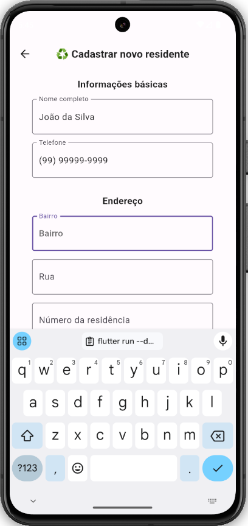
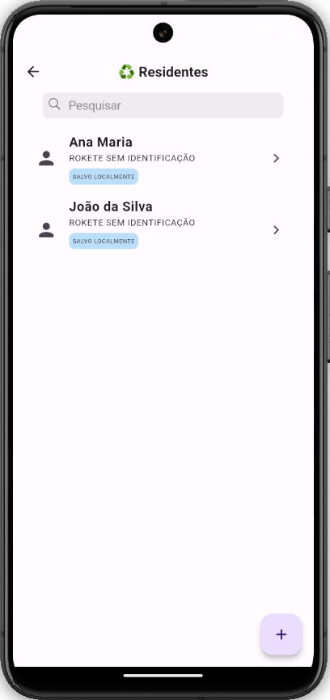
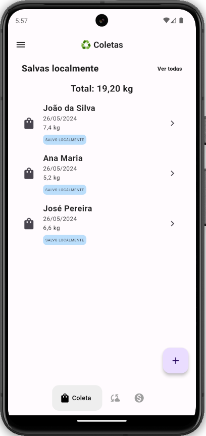
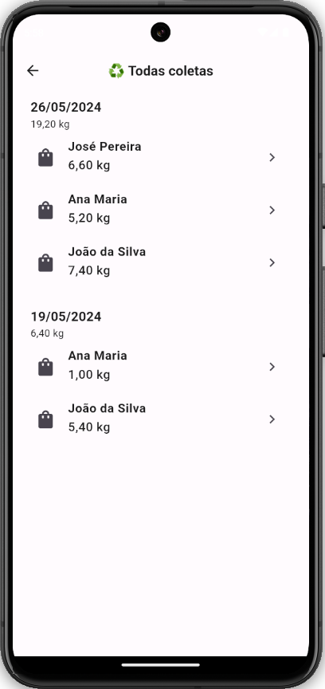
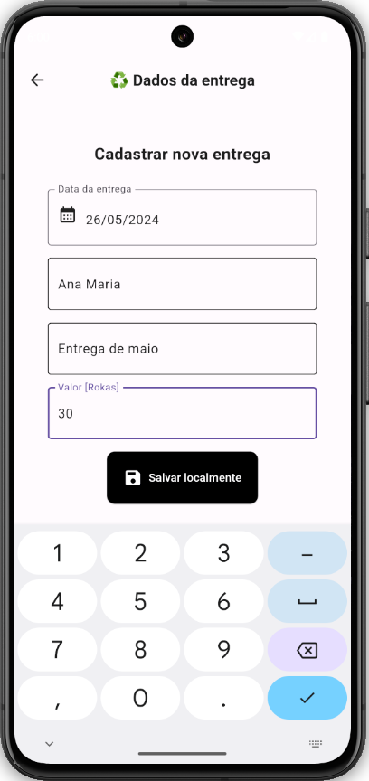
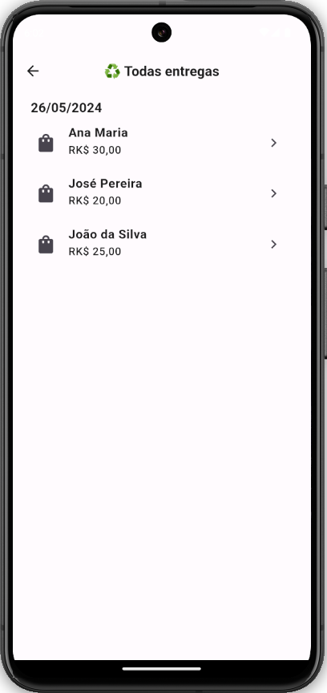

<p align="center">
   <br/>
  <a href="https://github.com/mateus-sartorio/roka-data-mobile-client"><kbd>🔵 GitHub</kbd></a>
</p>

# ♻️ Roka Data

### Sistema unificado de dados para o Projeto Roka.

<br/>

## 🔥 Funcionalidades

### 🏡 Gerencie cadastro dos moradores

<div align="left">
  
  
</div>
<br/>

### 🛍️ Gerencie a coleta de resíduos

<div align="left">
  
  
</div>

### 💰 Gerencie a distribuição da moeda social

<div align="left">
  
  
</div>

<br>

## 🍄 Filosofia

Este projeto destina-se a ser simples e fácil de usar. As funcionalidades são mantidas mínimas, mas refinadas.

<br/>

## ⚙️ Configurar e executar localmente

### Pré-requisitos:

- Flutter ([Instruções de instalação](https://docs.flutter.dev/get-started/install))
- Android SDK (`>= 34`) ([Instruções de instalação](https://developer.android.com/studio))
- Emulador de Android ([Instruções de instalação](https://developer.android.com/studio/run/emulator))
- Servidor Back End local, caso queira usar um banco de dados de desenvolvimento ([Instruções de configuração](https://github.com/mateus-sartorio/roka-data-backend))

Antes de começar, certifique-se que tenha todos os pré-requisitos para rodar o projeto.

Para checar a versão do `Flutter` instalada em sua máquina, execute o seguinte comando:

```bash
flutter --version
```

Certifique-se que sua versão do `Flutter` esteja entre `>=3.2.3` e `<4.0.0`.

> [!TIP]
>   Caso sua versão do `Flutter` não esteja entre `'>=3.2.3` e `<4.0.0'`, recomenda-se utilizar o `fvm`, que permite instalar e gerenciar várias versões do `Flutter` em sua máquina ([Página com instruções para instalação e uso](https://fvm.app/)).

### Configurando ambiente local

Clone o repositório localmente e em seguida entre no diretório do respositório clonado:

```bash
git clone https://github.com/mateus-sartorio/roka-data-mobile-client
cd roka-data-mobile-client
```

Caso queira utilizar um ambiente de produção, é necessário configurar um aquivo de variáveis de ambiente (`.env`) com a url de conexão com a API Rest do Back End. Para isso, renomeie `prod.example.json` para `prod.json` em `lib/configuration/env`. O comando abaixo realiza esta operação:

```bash
mv lib/configuration/env/prod.example.json lib/configuration/env/prod.json
```

No arquivo `prod.json`, configure a variável ambiente `baseUrl` com a url da API do Back End:

```json
{
  "baseUrl": "url para para a API"
}
```

### Rodando a aplicação

Para rodar a aplicação com o Back End de desenvolvimento local:

```bash
flutter run --dart-define-from-file=lib/configuration/env/dev.json
```

Para rodar a aplicação com o Back End de produção local:

```bash
flutter run --dart-define-from-file=lib/configuration/env/prod.json
```

### Gerando build de produção

Para gerar uma build de produção para Android (`apk`):

```bash
flutter build apk --dart-define-from-file=lib/configuration/env/prod.json
```

### Configurações adicionais

Caso altere o ícone ou a splash art da aplicação, rode o comando abaixo para aplicar as alterações:

```bash
flutter pub run flutter_launcher_icons
```


Caso faça alguma modificação nos modelos usados pelo `Hive`, gere novos metamodelos com o comando:

```bash
flutter pub run build_runner build
```

<br>

## ⚠️ Limitatações

- O sistema ainda não possui um sistema de cadastro e login de usuários.


## 🐞 Bugs conhecidos

- Dados podem não ser sincronizados com servidor as vezes, e dados que falham em ser sincronizados são descartados.

<br/>

## ⚖️ Licença:

Este programa é um software livre: você pode redistribuí-lo e/ou modificá-lo sob os termos da Licença Pública Geral GNU, conforme publicada pela Free Software Foundation; seja a versão 3 da Licença, ou (a seu critério) qualquer versão posterior.

Este programa é distribuído na esperança de que seja útil, mas SEM QUALQUER GARANTIA; sem mesmo a garantia implícita de COMERCIABILIDADE ou ADEQUAÇÃO A UMA FINALIDADE ESPECÍFICA. Consulte a Licença Pública Geral GNU para mais detalhes.

Você deveria ter recebido uma cópia da Licença Pública Geral GNU juntamente com este programa. Se não recebeu, consulte [www.gnu.org/licenses/](https://www.gnu.org/licenses/).

Este programa é lançado sob a licença GNU GPL v3+.

teste